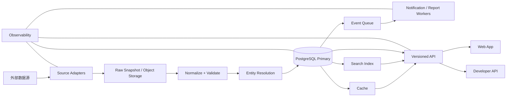

# SpaceData 完整商用开发执行文档

> 版本：1.0  
> 日期：2026-07-11  
> 适用范围：从当前代码状态推进到可持续运营、可收费、可审计的全球航天信息平台  
> 核心优先级：近期全球发射计划 > 航天全产业链 > 全球航天实体知识图谱 > 商业化能力

## 1. 文档目的

本文档不是愿望清单，而是后续开发、数据建设、测试、上线和运营的统一执行基线。每个阶段都必须形成可运行、可验收、可回滚的版本，不能等到最后一次性上线。

“完整商用”在本文中的定义是：

- 全球近期发射计划可稳定查询，关键任务信息具备来源、新鲜度和变更记录。
- 国家、机构、火箭、发射场、载荷、航天器、宇航员和产业链企业形成可追溯关系。
- 产业链数据具备统一分类、来源口径、编辑审核和置信度，不把估算值包装成事实。
- 中文和英文达到正式商用品质，日语和俄语至少不存在原始翻译键和明显混杂。
- 数据同步、数据库、缓存、搜索和通知链路具备监控、重试、降级、备份与恢复能力。
- 用户、订阅、支付、权限、审计、隐私、安全、客服和运营后台完整可用。
- 核心服务有明确 SLO、告警、事故响应与发布回滚流程。
- 商业功能、数据授权和法律文本通过目标经营地区的专业审查。

“世界上全部航天信息”不能被理解为一次性穷尽所有记录。商用上必须改写为可度量的覆盖目标：按国家、实体类型、时间范围、来源和数据新鲜度公布覆盖率，并持续补齐。

## 2. 产品定位

### 2.1 一句话定位

SpaceData 是一个以全球发射任务为实时入口、以航天实体关系和全产业链情报为深度价值的航天信息平台。

### 2.2 核心用户

1. 航天爱好者与媒体：查询下一次发射、直播、改期、结果与任务背景。
2. 行业从业者：查询机构、企业、产品、技术、供应链位置和竞争格局。
3. 投资与研究人员：按国家、赛道、公司、任务和时间分析行业活动。
4. 企业市场与采购团队：发现供应商、合作伙伴、客户、项目与能力缺口。
5. 开发者：通过受控 API 使用标准化发射、实体和产业数据。
6. 平台编辑与数据运营：处理来源冲突、实体合并、数据审核和用户反馈。

### 2.3 北极星指标

- 主要指标：每周获得有效答案的用户数，即完成发射查询、实体查询、产业链筛选、提醒订阅或数据导出的去重用户数。
- 数据指标：未来 30 天发射任务中，核心字段完整且 6 小时内更新的任务占比。
- 商业指标：付费团队月度活跃率、试用转付费率、净收入留存率。

## 3. 当前项目基线

### 3.1 已具备能力

- Next.js App Router 单体应用，具备国际化路由、用户系统和管理后台基础。
- Prisma + PostgreSQL 数据模型，覆盖发射、火箭、场地、机构、载荷、航天器、宇航员、企业、技术、材料和设备。
- 发射任务中心：下一次发射、24 小时、7 天、30 天、待确认、最近结果、状态统计和来源新鲜度。
- 国家与机构页面，以及国家发射能力和产业链画像。
- 上游、中游、下游产业链浏览器和国家筛选。
- LL2、SpaceX、CelesTrak 与历史数据同步脚本基础。
- 44 项 API/纯逻辑测试，lint 和生产构建可通过。
- 数据库不可用时，部分关键页面与 API 已有降级状态。

### 3.2 当前关键缺口

| 领域 | 当前状态 | 商用缺口 |
|---|---|---|
| 发射数据 | LL2 + SpaceX CLI 同步 | LL2 仍使用已停止支持的 2.2.0；无正式调度、同步运行记录、变更历史和多源冲突处理 |
| 数据库 | 单一 Neon 连接 | 当前存在间歇性不可达；缺少连接池、只读副本、备份恢复演练和跨区域策略 |
| 数据质量 | 有 `source`、`lastSyncedAt` | 缺少字段级来源、置信度、审核状态、覆盖率和质量看板 |
| 产业链 | 基础三段分类和企业关系 | 企业样本不足，产品/能力/项目/合同/融资关系不足，市场数字口径不透明 |
| API | 约 47 个 handler | 无公开版本、API key、配额、速率限制、使用计量和开发者文档 |
| 搜索 | 基础站内搜索 | 无统一实体索引、别名、多语言、模糊匹配和结果排序评估 |
| 通知 | 未形成产品 | 无发射提醒、改期提醒、结果提醒、邮件/推送/日历订阅 |
| 商业化 | 用户与登录基础 | 无套餐、订阅、支付、发票、试用、权限矩阵和用量计费 |
| 内容治理 | 管理后台基础 | 无编辑审核、双人复核、实体合并、来源冲突、审计日志 |
| 运维 | 构建可通过 | 无完整 CI/CD、监控、追踪、SLO、值班和事故复盘 |
| 安全合规 | 基础认证 | 无 ASVS 基线、威胁建模、密钥轮换、隐私请求、数据保留策略 |

## 4. 外部对标与产品取舍

### 4.1 发射产品对标

| 产品 | 借鉴点 | SpaceData 的差异化 |
|---|---|---|
| Next Spaceflight | 下一次发射、任务流、移动端体验、及时编辑 | 将发射进一步连接国家能力、企业和产业链 |
| RocketLaunch.Live | 高频更新、人工校对、变更记录、付费 API | 提供中文深度、本地化产业链和字段级数据可信度 |
| Space Launch Schedule | 地点、火箭、机构筛选，地图和直播入口 | 提供跨实体关系、研究工作台和企业情报 |
| Launch Library 2 | 广泛实体覆盖和标准 API | 不直接暴露源结构，建立多源标准化、版本和审核层 |

RocketLaunch.Live 将完整 API、详细统计和变更记录作为付费能力，说明“实时更新 + 可信变更 + API”具有明确商业价值。其公开说明也强调数据仍需核验，因此 SpaceData 不应承诺绝对准确，而应承诺来源透明、更新及时和错误可纠正。

### 4.2 产业链产品对标

产业链平台的商业价值不只是展示公司列表，而是帮助用户回答：谁具备某项能力、服务过哪些项目、与谁合作、在哪些国家运营、技术成熟度如何、最近发生了什么。

SpaceData 的产业链应逐步增加：

- 公司与机构标准档案。
- 产品、服务和能力标签。
- 供应关系、客户关系、联合项目和发射记录。
- 设施、工厂、发射场、地面站和区域分布。
- 融资、并购、合同、招标、认证和监管事件。
- 技术、材料、设备与实际任务之间的证据关系。
- 每条关系的来源、首次发现时间、最后确认时间和可信度。

## 5. 权威数据源与使用策略

### 5.1 数据源矩阵

| 数据域 | 主来源 | 补充来源 | 建议刷新 | 商用注意事项 |
|---|---|---|---|---|
| 近期发射 | LL2 2.3.0 | 官方机构、发射商、RocketLaunch.Live 商业 API | 5-15 分钟，临近任务 2-5 分钟 | LL2 匿名仅 15 次/小时，生产应购买 API key 并遵守署名/条款 |
| 发射直播与结果 | 发射商官方频道、NASA/ESA 等 | LL2、新闻源 | 1-5 分钟 | 保存链接和元数据，不重新分发无授权视频 |
| 火箭/机构/场地 | LL2、机构官网 | SpaceX API、官方资料 | 日更/周更 | 建立别名和实体合并规则 |
| 在轨物体 | CelesTrak SATCAT/GP | Space-Track | 2 小时或按源更新 | CelesTrak 明确要求只下载所需数据且每次更新只下载一次 |
| 任务与载荷 | LL2、官方任务页 | CelesTrak、NASA/ESA 数据 | 小时/日 | 任务名、载荷名和运营方需要实体解析 |
| 宇航员/载人任务 | LL2、NASA、ESA、各国机构 | 官方传记与任务页 | 日/周 | 人物照片和传记注意版权与署名 |
| 企业与产品 | 企业官网、监管披露、交易所公告 | 行业协会、新闻、招投标 | 日/周 | 事实、声明和推断必须区分 |
| 市场规模 | ESA/OECD/EUSPA、公开财报 | 采购的研究数据 | 季/年 | 保存统计口径、币种、基准年和估算方法 |
| 融资并购 | 交易所、公司公告、监管文件 | 商业数据库 | 日 | 商业数据库通常禁止原始数据再分发 |

### 5.2 立即修正项

LL2 官方文档目前推荐 `2.3.0`，并将 `2.2.0` 标为不再支持。现有同步器必须迁移：

- 将生产基础地址升级为 `/2.3.0`。
- 将 API 版本变成环境变量和适配器配置，而不是散落在 URL 字符串里。
- 增加 `/api-throttle` 配额监控。
- 开发环境使用官方建议的开发端点，生产使用 API key。
- 为响应 schema 建立契约测试，版本升级必须先跑兼容性报告。

### 5.3 来源分级

- A 级：政府机构、发射商、交易所、监管文件、标准组织。
- B 级：专业数据库、行业协会、经验证的商业数据提供商。
- C 级：主流媒体、公司新闻稿、研究机构报告。
- D 级：社区、聚合站、未验证社交内容，仅作为线索，不能直接形成核心事实。

### 5.4 数据事实类型

每个重要字段必须属于以下一种：

- `OBSERVED`：来源直接给出的事实。
- `DERIVED`：由公开字段计算得到，例如成功率。
- `ESTIMATED`：模型或分析人员估算，例如部分市场规模。
- `EDITORIAL`：编辑整理的描述或分类。
- `USER_SUBMITTED`：企业或用户提交，尚未或已经验证。

## 6. 产品信息架构

### 6.1 主导航

- 首页
- 发射计划
- 全球实体
- 产业链
- 研究与数据

“时间线、对比、深空探索、数据来源、开发者 API”放入二级导航或工作台，避免主导航再次膨胀。

### 6.2 发射计划中心

必须完整支持：

- 下一次发射和倒计时。
- 直播中、未来 24 小时、7 天、30 天、待确认、推迟、最近完成和失败。
- 本地时区、UTC 和发射场当地时区。
- 发射窗口、时间置信度和时间变更历史。
- 国家、机构、火箭、场地、轨道、任务类型和日期组合筛选。
- 列表、紧凑表格、日历和地图视图。
- Webcast、日历订阅、关注和提醒。
- 数据新鲜度、来源、冲突和离线状态。
- 任务详情中的载荷、轨道、企业、产业链和相关任务。

### 6.3 全球实体中心

实体类型：

- 国家/地区
- 航天机构
- 公司
- 火箭系列与型号
- 发射场与发射台
- 发射任务
- 载荷、卫星与在轨物体
- 航天器、空间站与探测器
- 宇航员、乘组、远征和舱外活动
- 技术、材料、设备、产品和服务
- 合同、融资、并购、招标和监管事件

所有实体必须有稳定 slug、别名、多语言名称、来源、审核状态、变更时间和合并记录。

### 6.4 产业链中心

平台继续使用便于用户理解的三段视图，但内部分类要兼容 ESA/OECD 口径：

- 上游：研究、材料、元器件、子系统、制造设备、地面系统、火箭和航天器制造。
- 中游：发射服务、任务运营、卫星运营、地面站、数据接收、处理、归档和分发。
- 下游：通信、导航、遥感、气象、农业、保险、金融、交通、海事、能源和公共服务应用。

需要单独标记“space-related/航天赋能”业务，避免把所有使用地图或通信的普通企业都算作航天企业。

### 6.5 研究工作台

- 多实体对比。
- 保存筛选器和观察列表。
- CSV/XLSX 导出。
- 图表和时间序列。
- 企业、国家、赛道和任务报告。
- 引用导出，包含来源 URL、访问时间、数据版本和口径。
- 团队共享、备注和可控权限。

## 7. 目标技术架构

初期不拆成大量微服务。保留 Next.js 产品应用，将耗时同步、实体解析、通知和报表任务从 Web 请求中分离为 Worker。

### 7.1 推荐边界

- `apps/web`：Next.js 页面、BFF、认证和订阅门户。
- `workers/ingestion`：源适配器、调度、重试和原始快照。
- `workers/notifications`：发射提醒、改期、失败、报告任务。
- `packages/domain`：标准枚举、实体类型、质量规则和纯逻辑。
- `packages/db`：Prisma schema、迁移和查询仓储。
- `packages/i18n`：跨端翻译键与实体名称策略。
- `packages/api-contracts`：OpenAPI schema、API DTO 和 SDK 类型。

在第一轮商用前可以继续保持单仓库，待 Worker 和 Web 的部署节奏明显分离后再转 Turborepo，不为形式提前迁移。

### 7.2 基础设施

- PostgreSQL：生产主库、连接池、自动备份、时间点恢复和恢复演练。
- 对象存储：保存原始响应、导出文件、报告和可授权媒体。
- Redis/队列：缓存、速率限制、幂等锁、通知和异步任务。
- 搜索：第一阶段 PostgreSQL 全文与 trigram；数据量和多语言检索达到阈值后迁移 Typesense/OpenSearch。
- CDN：静态资源、公开 API 缓存和图片优化。
- 密钥管理：开发、预发、生产完全隔离；禁止密钥进入仓库和客户端。

## 8. 数据平台设计

### 8.1 新增核心模型

- `Source`：来源、版本、授权、署名、刷新策略和负责人。
- `SyncRun`：每次同步的开始、结束、状态、数量、游标、错误和版本。
- `RawRecord`：原始对象位置、hash、抓取时间、源版本。
- `FieldEvidence`：实体字段、值、来源、观察时间、置信度和事实类型。
- `EntityAlias`：多语言名称、历史名称、缩写和源内 ID。
- `EntityMerge`：重复实体合并和可逆映射。
- `ChangeEvent`：发射时间、状态和实体字段的变更历史。
- `ReviewTask`：冲突、缺失、低置信度和用户反馈审核任务。
- `ProductCapability`：公司产品、服务、能力、成熟度和证据。
- `OrganizationRelationship`：供应、客户、投资、合作、母子公司和项目关系。
- `MarketMetric`：指标值、单位、币种、基准年、地域、口径和估算方法。
- `Watchlist`、`AlertRule`、`NotificationDelivery`：关注和通知闭环。
- `Subscription`、`Entitlement`、`UsageRecord`：商业权限和用量。
- `AuditLog`：管理操作、权限变化和敏感数据访问。

### 8.2 同步状态机

`PENDING -> FETCHING -> NORMALIZING -> RESOLVING -> VALIDATING -> PUBLISHING -> SUCCEEDED`

失败状态：

- `PARTIAL`：部分分页或部分实体成功，可发布但必须标记。
- `RATE_LIMITED`：记录恢复时间，不立即重复请求。
- `SOURCE_UNAVAILABLE`：源故障，继续服务最近成功版本。
- `VALIDATION_FAILED`：不发布异常批次，进入审核队列。
- `FAILED`：本次运行失败，保留最近成功版本。

### 8.3 发布原则

- 外部源先进入原始层，验证后再发布到标准实体层。
- 同一批次要么原子发布，要么保持上一版本。
- 每条发射任务保存最后成功版本，数据库或源短时故障时仍能只读展示。
- 即将发射任务采用更高刷新优先级，历史任务采用低频增量同步。
- 改期、取消、成功和失败生成 `ChangeEvent`，驱动通知。
- 删除采用软删除和来源失效标记，禁止因源端短时缺失直接物理删除。

### 8.4 数据质量评分

每个实体计算 0-100 分：

- 来源权威性 25 分。
- 新鲜度 20 分。
- 核心字段完整度 20 分。
- 多源一致性 15 分。
- 编辑审核 10 分。
- 关系可验证性 10 分。

分数必须可解释，不能只显示一个黑箱结果。

## 9. API 与开发者平台

### 9.1 API 规范

- 正式公开路径使用 `/api/v1/...`。
- 内部页面 BFF 与公开 API DTO 分离。
- OpenAPI 作为契约源，生成 TypeScript SDK。
- 列表统一 cursor pagination；管理后台可以保留 page pagination。
- 时间统一 ISO 8601 UTC，同时返回时间精度和时区信息。
- 错误统一 `{code, message, requestId, details}`。
- 所有响应包含 `generatedAt`、`dataVersion` 和来源摘要。

### 9.2 商业 API

- API key 创建、吊销、轮换。
- 套餐级速率限制与月度配额。
- 请求日志和用量看板。
- Webhook：发射改期、状态变化、任务新增、企业事件。
- 明确缓存、署名、再分发和历史数据权限。
- Sandbox 环境和示例代码。

## 10. 搜索与实体解析

### 10.1 搜索要求

- 中文、英文、官方名称、缩写、历史名称和别名检索。
- 拼写错误和近似匹配。
- 按实体类型、国家、产业环节和时间过滤。
- 结果显示命中原因和实体类型，避免名称相同造成误导。
- 搜索质量建立固定评测集，记录 top-1、top-5 命中率和零结果率。

### 10.2 实体解析规则

- 先匹配来源外部 ID，再匹配审核别名，最后才进行候选相似度匹配。
- 自动合并只允许高置信度且无冲突的记录。
- 公司不能仅因国家相同或名称包含关系而合并。
- 所有合并可撤销，并记录操作者与证据。

## 11. 用户、权限与商业化

### 11.1 套餐建议

| 套餐 | 目标用户 | 能力 |
|---|---|---|
| Free | 爱好者与轻度用户 | 发射计划、基础实体、少量提醒 |
| Pro | 研究者与专业个人 | 高级筛选、导出、历史变更、更多提醒、基础 API |
| Team | 企业团队 | 团队工作区、共享观察列表、批量导出、较高 API 配额 |
| Enterprise | 大客户 | SSO、审计、专属配额、数据授权、SLA、定制交付 |

### 11.2 权限模型

- RBAC：用户、编辑、审核员、数据管理员、客户管理员、系统管理员。
- Entitlement：按套餐控制导出、历史深度、API、提醒数量和团队人数。
- 管理后台必须使用服务端权限检查，不能依赖前端隐藏按钮。
- 企业版预留 SAML/OIDC SSO 和 SCIM，不在首个付费版本前强行实现。

### 11.3 支付

- 使用托管 Checkout 和托管客户门户，减少支付卡数据接触范围。
- Webhook 幂等处理订阅创建、续费、失败、退款和取消。
- 权限以支付事件同步后的服务端状态为准。
- 发票、税务和退款政策按经营主体和地区接入专业服务。

## 12. 编辑审核与运营后台

后台必须新增：

- 同步运行看板和数据源健康。
- 原始记录与标准记录对比。
- 冲突字段审核。
- 重复实体候选与合并/撤销。
- 发射计划人工覆盖，保存原因、来源和过期时间。
- 企业认领和资料提交审核。
- 用户举报、评论审核与封禁。
- 套餐、用量、支付事件和客户支持视图。
- 所有高风险操作审计日志。

人工覆盖不能永久遮蔽外部源。必须设置生效范围、优先级、负责人和自动过期时间。

## 13. 通知与留存

### 13.1 用户通知

- 发射前 24 小时、1 小时、10 分钟提醒。
- 发射时间变化、推迟、取消、直播开始和结果提醒。
- 按国家、机构、火箭、场地和任务类型订阅。
- Email、Web Push、站内通知和 ICS 日历订阅。
- 通知去重、时区、静默时段、退订和投递状态。

### 13.2 运营内容

- 每日全球发射摘要。
- 每周国家与机构活动榜。
- 每月产业链变化、融资并购和合同摘要。
- 自动草稿必须由编辑审核后发布，不能直接把生成内容作为事实。

## 14. 国际化与内容规范

- 中文和英文为正式支持语言，关键流程逐页验收。
- 实体官方名称默认保留，增加可审核的本地化名称字段。
- UI 文案、枚举、空状态、错误、通知和邮件全部走翻译键。
- 日期、数字、货币、单位和时区按 locale 格式化。
- 自动翻译必须标记机器翻译状态；专业术语建立术语库。
- CI 增加翻译键一致性和硬编码文案扫描。

## 15. 可靠性、监控与灾备

### 15.1 商用 SLO

| 服务 | 目标 |
|---|---|
| 公共页面月可用性 | 99.9% |
| 核心 API 月可用性 | 99.9% |
| 发射列表缓存命中响应 P95 | < 500ms |
| 搜索 P95 | < 800ms |
| 未来 30 天发射新鲜度 | 95% 在 15 分钟内，99% 在 60 分钟内 |
| 严重改期通知延迟 P95 | < 5 分钟 |
| RPO | <= 15 分钟 |
| RTO | <= 2 小时 |

首个 Beta 可以采用较低目标，但公开 SLA 前必须连续 30 天达到目标。

### 15.2 监控

- Web Vitals、页面错误和 API 延迟。
- 数据库连接、慢查询、连接池和存储增长。
- 每个来源的成功率、延迟、配额、新鲜度和字段漂移。
- 队列长度、失败任务、重试和死信队列。
- 通知发送、退信、投诉和退订。
- 登录失败、权限拒绝、API key 异常和速率限制。
- 业务指标与数据覆盖率。

### 15.3 灾备

- 自动备份不等于恢复能力；每季度执行恢复演练。
- 原始数据快照与标准数据库分开保存。
- 数据库不可用时，公开发射页读取最近成功发布快照。
- 为关键源保存最后成功数据版本，避免源故障导致空页面。
- 发布必须支持一键回滚到上一应用版本和上一数据版本。

## 16. 安全与合规

### 16.1 安全基线

- 采用 OWASP ASVS 5.0 作为应用安全验收基线，首个商用版至少达到适用的 Level 2 控制。
- 登录、注册、找回密码、OAuth 回调和管理接口实施速率限制。
- 会话 cookie、CSRF、CSP、安全响应头和依赖漏洞扫描。
- 管理员启用 MFA，高风险操作二次确认。
- 数据库最小权限，生产环境禁止个人共享管理员账号。
- 密钥定期轮换，日志禁止记录 token、密码和完整个人信息。
- 依赖、容器和基础设施持续扫描。
- 上线前完成威胁建模和第三方渗透测试。

### 16.2 隐私

- 数据最小化、默认隐私、明确用途和保留期限。
- 用户可导出、更正和删除账户数据。
- 分析、营销与必要 cookie 分离，并记录同意。
- 供应商清单、数据处理协议和跨境传输路径可审计。
- 中国用户涉及《个人信息保护法》及跨境传输要求；欧盟用户涉及 GDPR 的 privacy by design/default。具体实施必须由目标地区律师审查。
- 如果在中国大陆部署或经营，另行完成 ICP、公安备案、内容与增值电信业务适用性评估。

### 16.3 数据授权

- 建立数据源登记表：条款、许可证、署名、缓存、修改、再分发、商业使用和终止后处理。
- 付费 API 不等于自动拥有上游数据再销售权。
- 图片、视频和公司 logo 分别记录授权；无授权时使用链接或自有占位图。
- 商业报告中的估算模型保存方法和免责声明。

## 17. 测试与发布门禁

### 17.1 测试层级

- 纯逻辑单元测试：状态映射、时间、筛选、实体解析、质量评分和计费权限。
- Schema/契约测试：每个外部源样本和公开 API OpenAPI。
- 数据库集成测试：迁移、事务、唯一约束、幂等同步和回滚。
- API 集成测试：认证、权限、缓存、错误和配额。
- 浏览器 E2E：访客、注册、订阅、提醒、导出、后台审核。
- 视觉回归：核心页面的桌面和移动端截图。
- 负载测试：发射日前高流量、搜索、API 和通知峰值。
- 恢复测试：数据库恢复、源中断、队列积压和应用回滚。

### 17.2 合并门禁

- 单元与集成测试通过。
- lint、类型检查、生产构建通过。
- Prisma migration 在空库和生产快照副本上验证。
- 翻译键完整，核心页面无硬编码混合语言。
- 安全扫描无未接受的高危问题。
- 影响核心流程的改动有 E2E 或回归测试。
- 数据源 schema 变化有兼容性报告。

### 17.3 环境

- Local：开发者本地，可使用 LL2 开发端点和脱敏样本。
- Preview：每个 PR 独立应用，不连接生产写库。
- Staging：生产同构，使用独立数据库、队列和支付测试环境。
- Production：最小权限、受控迁移、监控和回滚。

## 18. 分阶段执行路线

以下工期按 4-6 人核心团队估算。单人开发应按能力并行度将时间放大 2-3 倍，并减少同期功能。

### Phase 0：稳定当前基线（2 周）

目标：让当前代码成为可持续迭代基线。

任务：

- 冻结并记录当前功能清单、路由、API 和 schema。
- 清理未提交变更，拆分为可审查提交。
- 建立 CI：test、lint、typecheck、build、翻译检查。
- 建立 staging 环境和独立数据库。
- Neon 连接池、超时、重试和连接监控。
- 解决仍存在的中英文硬编码和错误状态。
- 为关键页面增加 E2E smoke test。

退出标准：

- 主分支可重复构建。
- PR 有自动门禁。
- staging 连续 7 天无 P0/P1 故障。
- 发射页、产业链页、登录流程在中英文和移动端通过。

### Phase 1：生产级发射数据管线（4 周）

目标：发射计划不再依赖人工 CLI 和单一瞬时数据库连接。

任务：

- LL2 2.3.0 适配器和契约测试。
- 新增 `Source`、`SyncRun`、`RawRecord`、`ChangeEvent`。
- 队列化同步、游标、幂等锁、退避、配额监控。
- 保存原始响应和最近成功发布快照。
- 即将发射高频调度，历史数据低频增量。
- 数据源健康后台和告警。
- 发射时间/状态变更历史。
- 官方来源人工覆盖和自动过期。

退出标准：

- 连续 14 天自动同步成功率 >= 99%。
- 源或数据库短时故障时，页面展示最近成功版本。
- 同一外部记录重复同步不产生重复实体。
- 所有发射变更可追溯到来源和同步批次。

### Phase 2：完整发射产品（4 周）

目标：形成可日常使用、可留存用户的发射产品。

任务：

- 完整筛选、地图、日历和发射场时区。
- ICS 订阅、观察列表和发射提醒。
- 直播状态、结果和回放入口。
- 任务详情中的载荷、轨道、机构、企业和相关任务。
- 改期时间线和数据可信度解释。
- SEO、结构化数据、社交分享图。
- 浏览器 E2E、视觉回归和发射日负载测试。

退出标准：

- 用户可在 30 秒内找到下一次指定国家/机构发射并设置提醒。
- 未来 30 天核心字段完整率 >= 95%。
- 发射页 P95 和可用性达到内部 SLO。

### Phase 3：全球实体知识图谱（6 周）

目标：统一国家、机构、公司、火箭、场地、载荷和航天器关系。

任务：

- `EntityAlias`、`FieldEvidence`、`EntityMerge`、`ReviewTask`。
- 多源 ID、别名、重复候选和人工合并工具。
- 国家、机构、公司、火箭、场地和载荷标准详情页。
- 全局搜索索引和质量评测集。
- 字段级来源、置信度和审核状态。
- 用户纠错入口与编辑闭环。

退出标准：

- 核心实体重复率 < 1%。
- 固定搜索评测集 top-5 命中率 >= 95%。
- 重要实体字段可查看来源证据。

### Phase 4：产业链数据平台（8 周）

目标：从展示型产业链升级为可研究、可验证的行业情报产品。

任务：

- 完成产业分类字典和 ESA/OECD 映射。
- `ProductCapability`、`OrganizationRelationship`、`MarketMetric`。
- 企业认领、资料提交、审核和认证标识。
- 国家、赛道、产品、能力、技术和成熟度筛选。
- 企业对比、关系图、地图和事件时间线。
- 融资、并购、合同、招标和监管事件数据。
- 市场指标口径、币种、年份和估算说明。
- 研究工作台、保存视图和导出。

退出标准：

- 重点航天国家和重点赛道有明确覆盖率报告。
- 每个重要企业至少有一个来源和一个产业环节证据。
- 市场数字全部带口径、时间、来源和事实类型。

### Phase 5：用户增长与通知（4 周）

目标：建立从访问到持续使用的闭环。

任务：

- 关注列表、提醒规则、通知中心。
- Email、Web Push、ICS。
- 每日/每周摘要。
- 用户偏好、时区、语言和通知频率。
- 投递监控、退订、退信和投诉处理。

退出标准：

- 发射改期通知无重复且可追踪。
- 用户可独立管理订阅和退订。
- 通知投递失败有自动重试和告警。

### Phase 6：付费 Beta（6 周）

目标：验证用户是否愿意为高质量数据、提醒、导出和 API 付费。

任务：

- Free/Pro/Team 套餐和 Entitlement。
- 托管支付、订阅门户和 webhook。
- 高级筛选、历史变更、批量导出和 API key。
- 用量计量、配额、账单状态和客服工具。
- 服务条款、隐私政策、数据许可证和退款政策审查。
- Beta 客户反馈和产品分析。

退出标准：

- 支付、续费、失败、退款和取消流程 E2E 通过。
- 权限不存在前端绕过。
- 获得首批真实付费用户并验证核心付费理由。

### Phase 7：商用 GA（6 周）

目标：达到可公开销售、可支持企业客户的稳定水平。

任务：

- 生产 SLO、值班、状态页和事故流程。
- 备份恢复与灾难演练。
- ASVS 5.0 Level 2 适用项审计和渗透测试。
- 数据保护、供应商、跨境、ICP/经营地区审查。
- API 文档、SDK、客户 onboarding 和支持 SLA。
- 性能、成本和容量评估。
- 企业合同模板、数据使用边界和 DPA。

退出标准：

- 连续 30 天达到内部 SLO。
- 无未接受的高危安全问题。
- 恢复演练达到 RPO/RTO。
- 法律、数据授权和商业流程完成签字确认。

### Phase 8：规模化与持续完成（持续）

- 更多国家和本地权威数据源。
- 企业版 SSO/SCIM。
- 高级图谱分析和市场预测。
- 合作伙伴数据交换和企业 API。
- 移动应用或 PWA 深化。
- 数据编辑团队、客户成功和行业专家网络。

平台不会在 GA 后停止开发。“完全完成”应理解为核心商业闭环达到定义，而覆盖率、数据源和行业深度持续迭代。

## 19. 前 30 天执行清单

### 第 1 周：工程基线

- 把当前大批未提交改动按发射、国家、产业链、国际化、同步器分组审查。
- 建立 CI 和 staging。
- 增加 `.env.example`、环境变量校验和启动诊断。
- 修复数据库连接池和超时策略。
- 建立核心路由 smoke E2E。

### 第 2 周：LL2 2.3.0

- 建立源适配器接口和版本配置。
- 收集 LL2 2.3.0 发射、机构、场地和载荷样本。
- 写契约测试并迁移字段。
- 加入 API key、配额查询和开发端点。
- 完成 staging 全量同步。

### 第 3 周：同步运行与最近成功快照

- 增加 `Source`、`SyncRun`、`RawRecord`、`ChangeEvent` migration。
- 保存原始响应 hash 和批次。
- 实现队列任务、幂等锁和失败恢复。
- 公开 API 在主库不可用时读取最近成功快照。
- 建立数据源健康后台。

### 第 4 周：发射变更与提醒基础

- 生成发射时间和状态变更事件。
- 任务详情展示变更历史。
- 创建观察列表和提醒规则模型。
- 完成邮件测试通道和通知去重。
- 做一次源不可用、数据库不可用和恢复演练。

30 天验收：自动同步、变更历史、最近成功快照和健康看板必须在 staging 连续运行 7 天。

## 20. 团队配置

最小商用团队建议：

- 1 名产品/领域负责人：范围、优先级、数据口径与客户访谈。
- 1-2 名前端/全栈工程师：Web、工作台、国际化和 E2E。
- 1 名后端/数据工程师：同步、实体解析、API、队列和数据库。
- 0.5-1 名 DevOps/SRE：CI/CD、监控、安全、成本和灾备。
- 1 名数据编辑/行业研究：来源审核、分类、冲突和内容质量。
- 设计、法务、安全测试和翻译可阶段性外包，但责任人不能缺失。

单人路线必须先完成 Phase 0-2，再做 Phase 3-4，最后商业化；不要同时开发移动端、企业 SSO、AI 报告和复杂市场预测。

## 21. KPI 与阶段评审

### 数据 KPI

- 未来 30 天发射覆盖率、核心字段完整率、新鲜度和冲突率。
- 国家、机构、公司和产业环节覆盖率。
- 重复实体率、审核积压和用户纠错处理时间。
- 来源成功率、配额和 schema 漂移次数。

### 产品 KPI

- 下一次发射页到任务详情点击率。
- 提醒创建率和通知打开率。
- 搜索零结果率和搜索后成功行为率。
- 产业链筛选、企业详情、对比和导出使用率。
- 7/30 日留存。

### 商业 KPI

- 试用激活率和试用转付费率。
- 付费账户活跃率。
- MRR、ARPA、流失率和净收入留存。
- API 调用量、超额使用和企业销售周期。

每个 Phase 结束必须举行一次 Go/No-Go 评审。未达到退出标准时，先修复质量与可靠性，不自动进入下一阶段。

## 22. 风险清单

| 风险 | 影响 | 缓解措施 |
|---|---|---|
| 单一发射源故障或限流 | 近期计划过期 | 购买额度、多源校验、最近成功快照、官方人工覆盖 |
| 数据授权不允许再分发 | 商业模式受阻 | 上线前来源登记与法律审查，区分页面展示、导出和 API 权限 |
| 数据库间歇不可达 | 页面空白、同步失败 | 连接池、备份、只读快照、缓存、监控和恢复演练 |
| 实体重复与错误合并 | 统计和关系错误 | 外部 ID 优先、审核别名、可逆合并、置信度阈值 |
| 市场规模数据不一致 | 研究结果失真 | 口径、年份、币种、方法和来源并列展示 |
| 国际化硬编码回归 | 商用品质下降 | CI 翻译键与硬编码扫描、核心流程双语 E2E |
| 提醒重复或延迟 | 用户信任下降 | ChangeEvent、幂等 delivery、队列监控和去重 |
| 过早微服务化 | 开发和运维成本失控 | 保持单仓库，先分 Worker 边界，按部署需求拆分 |
| 付费功能无真实需求 | 商业失败 | Phase 6 前持续客户访谈和付费意向验证 |
| 合规跨境与内容风险 | 无法运营或处罚 | 目标市场法律审查、数据最小化、供应商与跨境记录 |

## 23. 商用完成验收总表

只有全部满足，才能称为“完整商用版本”：

- [ ] 发射数据自动同步、多源校验、变更历史和最近成功快照上线。
- [ ] 核心发射数据达到公开覆盖率和新鲜度目标。
- [ ] 主要实体拥有稳定 ID、别名、来源、证据和审核状态。
- [ ] 产业链分类、企业能力、关系和指标口径可追溯。
- [ ] 中文和英文核心流程通过人工与自动验收。
- [ ] 搜索、筛选、提醒、导出和研究工作台可用。
- [ ] Free、Pro、Team 权限、支付和订阅生命周期完整。
- [ ] API key、配额、文档、SDK 和 webhook 可用。
- [ ] 后台审核、实体合并、同步健康和审计日志可用。
- [ ] CI/CD、监控、状态页、告警、备份、恢复和回滚可用。
- [ ] 安全审计、渗透测试和高危问题关闭。
- [ ] 数据授权、隐私、服务条款、支付和经营地区合规完成审查。
- [ ] 连续 30 天达到内部 SLO，并完成一次灾难恢复演练。
- [ ] 客服、退款、数据纠错和事故响应责任明确。

## 24. 参考资料

- [Launch Library 2 v2.3.0 官方文档](https://lldev.thespacedevs.com/)
- [RocketLaunch.Live API 与商业能力](https://www.rocketlaunch.live/api)
- [CelesTrak 使用策略](https://www.celestrak.org/usage-policy.php)
- [CelesTrak GP 数据格式](https://www.celestrak.org/NORAD/documentation/gp-data-formats.php)
- [CelesTrak SATCAT 格式](https://www.celestrak.org/satcat/satcat-format.php)
- [ESA/OECD 航天经济分类](https://space-economy.esa.int/article/34/measuring-the-space-economy)
- [ESA 航天经济数据方法与限制](https://space-economy.esa.int/article/203/esa-space-economy-understanding-data-on-the-space-sectors-economic-value)
- [ESA 2025 航天经济报告](https://space-economy.esa.int/article/287/esa-report-on-the-space-economy-2025)
- [欧盟委员会 Privacy by Design/Default](https://commission.europa.eu/law/law-topic/data-protection/rules-business-and-organisations/obligations/what-does-data-protection-design-and-default-mean_en)
- [中国《个人信息保护法》](https://www.miit.gov.cn/jgsj/zfs/fl/art/2022/art_515a4b20c12f430eab54bb4f56d89f56.html)
- [OWASP ASVS](https://owasp.org/www-project-application-security-verification-standard/)

## 25. 执行原则

1. 先保证近期发射计划可信，再扩展更广的实体和产业数据。
2. 先保存来源和证据，再做漂亮统计和 AI 总结。
3. 先建立最近成功版本和恢复能力，再提高同步频率。
4. 先验证用户愿意为哪项价值付费，再扩大商业功能。
5. 每个阶段都必须可运行、可测试、可监控、可回滚。
6. 所有“完整、实时、全球、权威”的对外表述都必须有可量化口径支持。
